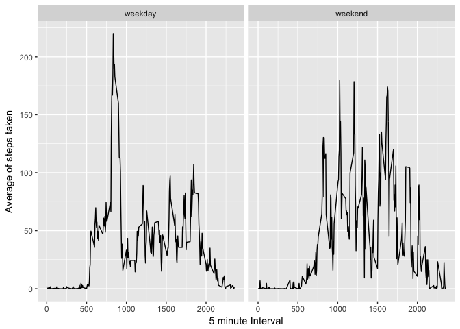

# Reproducible Research: Peer Assessment 1

##Libraries
Libraries needed for the course project

```r
library(dplyr)
```

```
## 
## Attaching package: 'dplyr'
```

```
## The following objects are masked from 'package:stats':
## 
##     filter, lag
```

```
## The following objects are masked from 'package:base':
## 
##     intersect, setdiff, setequal, union
```

```r
library(ggplot2)
```

## Loading and preprocessing the data

```r
activity<-read.csv("activity.csv",header = TRUE)
activity$date<-as.Date(activity$date)
```

## What is mean total number of steps taken per day?

```r
total.day <- activity %>%  group_by(date) %>%  summarise(sum=sum(steps,na.rm=TRUE))
ggplot(total.day)+geom_histogram(aes(x=sum),binwidth=5000)+xlab("Total steps")+ylab("Frequency")
```

<!-- -->


```r
mean(total.day$sum,na.rm=TRUE)
```

```
## [1] 9354.23
```

Median of steps taken per day:

```r
median(total.day$sum,na.rm=TRUE)
```

```
## [1] 10395
```


## What is the average daily activity pattern?

```r
pattern <- activity %>% group_by(interval) %>% summarise(mean=mean(steps,na.rm=TRUE))
ggplot(pattern, aes(x=interval,y=mean)) + geom_line() + xlab("5 minute Interval") + ylab("Average of steps taken")
```

<!-- -->

```r
#5-minute interval which contains the maximum number of steps
as.numeric(arrange(pattern,desc(mean))[1,"interval"])
```

```
## [1] 835
```

## Imputing missing values

```r
#Total number of missing values
sum(is.na(activity$steps))
```

```
## [1] 2304
```

```r
#Replace them with the average of its 5 minute interval
replaceNA <- function(steps,interval){
  if(is.na(steps)==TRUE){
    return(pattern[pattern$interval==interval,]$mean)
  } else {
    return(steps)
  }
}
activity2 <- activity
activity2$steps <- mapply(replaceNA,activity$steps,activity$interval)
```

```r
total.day2 <- activity2 %>%  group_by(date) %>%  summarise(sum=sum(steps,na.rm=TRUE))
ggplot(total.day2)+geom_histogram(aes(x=sum),binwidth=5000)+xlab("Total steps")+ylab("Frequency")
```

<!-- -->


```r
#before imputing missing values
mean(total.day$sum,na.rm=TRUE)
```

```
## [1] 9354.23
```

```r
#after
mean(total.day2$sum,na.rm=TRUE)
```

```
## [1] 10766.19
```

Median of steps taken per day:

```r
#before imputing missing values
median(total.day$sum,na.rm=TRUE)
```

```
## [1] 10395
```

```r
#after
median(total.day2$sum,na.rm=TRUE)
```

```
## [1] 10766.19
```

## Are there differences in activity patterns between weekdays and weekends?

```r
activity2$day <- weekdays(activity2$date)
activity2$day <- as.factor(ifelse(activity2$day %in% c("sabado","domingo"),"weekend","weekday"))
pattern2 <- activity2 %>% group_by(day,interval) %>% summarise(mean=mean(steps,na.rm=TRUE))
ggplot(pattern2, aes(x=interval,y=mean)) + geom_line() + facet_grid(. ~ day) + xlab("5 minute Interval") + ylab("Average of steps taken")
```

<!-- -->
